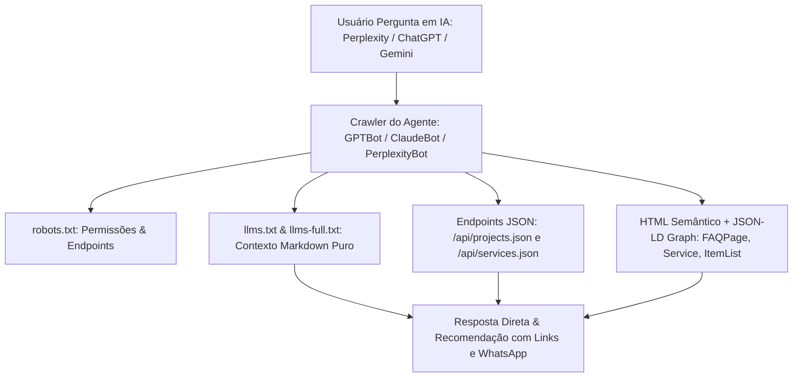

# 🤖 Diretrizes de Desenvolvimento Web Agêntica & GEO — Tentáculos Lab

Este documento estabelece a arquitetura, padrões e práticas para tornar o website do **Tentáculos Lab** 100% **Agêntico**, otimizado para extração, interpretação e recomendação precisa por **Agentes de Inteligência Artificial** e **Motores de Busca Generativos (GEO - Generative Engine Optimization)**.

---

## 🎯 1. O que é um Website Agêntico?

Um **Website Agêntico** não é construído apenas para humanos navegando com navegadores visuais, mas também para **Agentes Autônomos de IA** (como ChatGPT Search, Perplexity, Claude, Gemini, Apple Intelligence, DeepSeek, Cursor, agentes de cotação corporativa, etc.).

Quando um usuário pergunta a uma IA:
> *"Qual estúdio em São Paulo faz cenografia 3D para palcos de festivais com entrega em SketchUp .skp?"*

O site do Tentáculos Lab deve fornecer dados estruturados, contextuais e factuais para que o motor generativo cite e recomende a empresa com máxima precisão e confiança.

---

## 🏗️ 2. Pilares da Arquitetura Agêntica do Tentáculos Lab

---

## 📄 3. Padrão `llms.txt` e `llms-full.txt` (Answer.AI Standard)

Localizados na pasta `/public`, estes arquivos eliminam a necessidade de parsers pesados de HTML ou execução de JavaScript para os modelos:

1. **`public/llms.txt`**:
   * Resumo de alto nível (Executive Summary).
   * Declaração inequívoca de nicho: *O que fazemos e o que NÃO fazemos* (ex: cenografia de grandes eventos vs. maquetes imobiliárias residenciais).
   * Links diretos para os endpoints de API e contatos oficiais.
2. **`public/llms-full.txt`**:
   * Base de conhecimento exaustiva para ingestão profunda (RAG / Context Ingestion).
   * Especificações técnicas completas dos projetos (metragem, altura, iluminação LED, cronograma de montagem).
   * Seção **FAQ Estruturada** com respostas prontas para citação direta por IAs.

---

## 🔌 4. Endpoints de Dados Legíveis por Máquina (`/api/`)

Disponíveis diretamente no servidor estático para agentes que consomem JSON:

* **`GET /api/projects.json`**:
  * Lista completa de projetos com metadados: dimensões, tags, cliente, ano, suporte a arquivos `.skp` e visualização 3D.
* **`GET /api/services.json`**:
  * Catálogo de serviços, entregáveis, público-alvo e escopo técnico.

---

## 🔍 5. Schema.org e Dados Estruturados em JSON-LD (`index.html`)

O HTML inclui um grafo unificado `@graph` contendo:
* **`ProfessionalService`**: Dados de contato, cidade, logotipo, escopo de serviços e conhecimentos específicos (`knowsAbout`).
* **`FAQPage`**: Perguntas e respostas formuladas especificamente para resolver intenções de busca frequentes de tomadores de decisão em eventos.
* **Headers `<link rel="alternate">`**: Permitem que navegadores com suporte a agentes e extensões de IA localizem imediatamente a versão textual estruturada.

---

## 🤖 6. Permissões de Crawlers no `robots.txt`

Todos os agentes de IA de primeira linha são explicitamente bem-vindos:
* `GPTBot`, `ChatGPT-User`, `OAI-SearchBot` (OpenAI)
* `ClaudeBot` (Anthropic)
* `PerplexityBot` (Perplexity AI)
* `Google-Extended` (Gemini e AI Overviews)
* `Applebot-Extended` (Apple Intelligence)
* `Meta-ExternalAgent` (Meta AI)
* `cohere-ai`, `Amazonbot`

---

## ✅ 7. Protocolo de Revisitação Contínua de Dados (JSON-LD & Rich Snippets)

> 💡 **Regra de Manutenção Ativa:**  
> À medida que o projeto do Tentáculos Lab evolui, novas informações (materiais, dimensões exatas, novos clientes, fotos finais ou novas perguntas frequentes) serão adicionadas. É mandatório **revisitar e sincronizar todos os esquemas estruturados** para evitar dados desatualizados ou contraditórios entre o frontend e os motores de busca/IA.

Ao cadastrar, alterar ou enriquecer qualquer projeto ou serviço:

1. [ ] Atualizar o catálogo central em `src/data/defaultProjects.js`.
2. [ ] **Revisitar o JSON-LD em `index.html`**: Atualizar o bloco `@graph` (`ItemList`, `CreativeWork` ou `FAQPage`) com os novos dados.
3. [ ] **Sincronizar APIs Estáticas**: Replicar as especificações exatas em `public/api/projects.json` e `public/api/services.json`.
4. [ ] **Atualizar Base de IA**: Se houver novidades técnicas ou novos projetos, refletir em `public/llms.txt` e `public/llms-full.txt`.
5. [ ] **Sitemap de Imagens**: Garantir que novos renders estejam cadastrados em `public/sitemap.xml` com atributos `<image:image>`.
6. [ ] Garantir que nenhum termo técnico de engenharia cenotécnica esteja divergente entre os arquivos.
