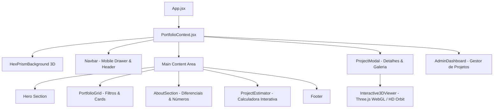

# 🏛️ Arquitetura do Sistema — Tentáculos Lab

Este documento detalha a estrutura de engenharia, arquitetura de componentes, fluxo de dados e pipeline gráfico do website do **Tentáculos Lab**.

---

## 🧭 1. Visão Geral da Arquitetura

O sistema é uma **Single Page Application (SPA)** reativa de alta performance construída sobre a tríade **Bun + Vite + React 19**, com estilização em **Tailwind CSS v4** e gráficos tridimensionais proceduralmente renderizados em **Three.js (WebGL)**.

---

## 📦 2. Camada de Estado Global (`PortfolioContext`)

Localizado em `src/context/PortfolioContext.jsx`, gerencia:
1. **Catálogo de Projetos**: Inicializado a partir de `src/data/defaultProjects.js` e mantido sincronizado no `localStorage` do navegador para permitir edições locais.
2. **Filtros e Categorias**: Filtro ativo por categoria (Cenografia, Especiais, 3D, etc.).
3. **Modal Ativo**: Estado do projeto em exibição ampliada (`activeProject`).
4. **Painel Administrativo**: Abertura e autenticação do dashboard de gerenciamento interno.
5. **Importação e Exportação**: Funções para download e upload de dados em formato JSON.

---

## 🎨 3. Módulos & Componentes Principais

### 3.1. `HexPrismBackground.jsx` (Cenário de Fundo 3D)
* **Objetivo**: Fornece um ambiente visual sutil, sofisticado e tecnológico sem disputar a atenção com o conteúdo textual.
* **Implementação**: Instancia prismas hexagonais tridimensionais que oscilam suavemente no eixo Z, com shaders que reagem à cor de destaque (ciano/âmbar).
* **Descarte de Memória**: Implementa ciclo de limpeza rigoroso (`dispose()` de geometrias e materiais) no desmonte do componente para evitar vazamento de memória (Memory Leak) em navegação prolongada.

### 3.2. `Interactive3DViewer.jsx` (Visualizador 3D do Projeto)
* **Objetivo**: Permitir que o cliente inspecione os projetos e maquetes 3D em 360 graus.
* **Capacidades**:
  * Rotação automática suave com controle de pausa.
  * Interação por toque (mobile drag) e mouse (desktop drag).
  * Iluminação de estúdio (Key Light, Fill Light, Rim Light).
  * **Fallback Gracioso HD**: Se o navegador móvel não suportar WebGL com boa taxa de quadros, chaveia transparentemente para a visualização de ângulos pré-renderizados em alta definição.

### 3.3. `ProjectEstimator.jsx` (Calculadora Interativa)
* **Objetivo**: Qualificação de leads e estimativa imediata de valores de projetos cenográficos.
* **Lógica**: Considera metragem quadrada estimada, complexidade de iluminação cênica, nível de acabamento e prazo de entrega, integrando-se via botão de encaminhamento direto para o WhatsApp do atendimento.

---

## ⚡ 4. Pipeline de Assets e Mídia

* **Ativos Estáticos**: Ficam concentrados na pasta `public/` para acesso direto e sem overhead de empacotamento:
  * `public/models/`: Imagens e texturas em alta resolução dos projetos cenográficos.
  * `public/bg-blueprint-*.jpg`: Texturas de fundo com temática blueprint arquitetônico.
  * `public/favicon.*`, `logo.png`: Identidade visual da marca.
* **Modelos Brutos**: Arquivos pesados de software CAD/Sketchup (`*.skp`) são excluídos do controle de versão para preservar a leveza e velocidade dos builds.
